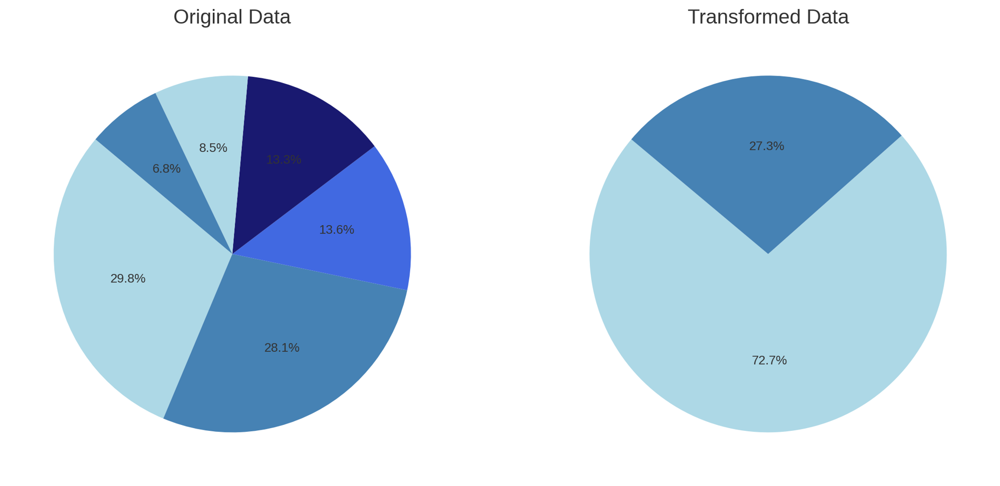
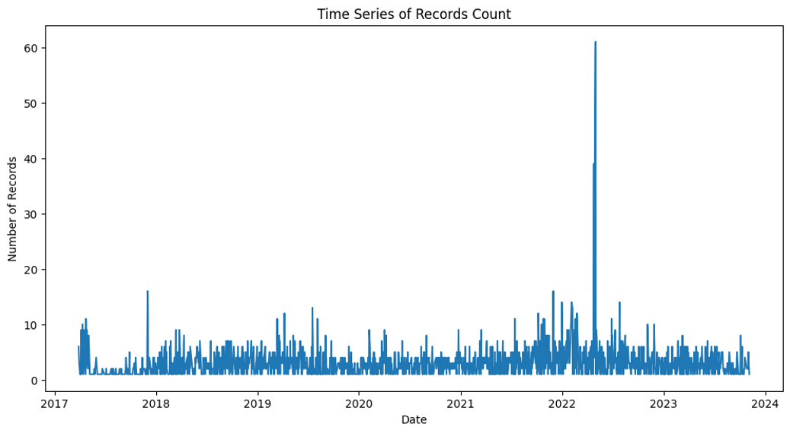
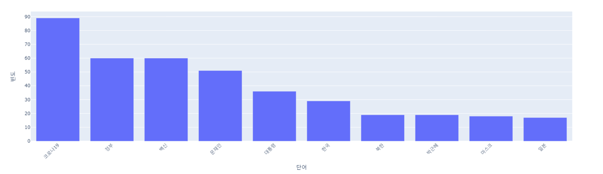
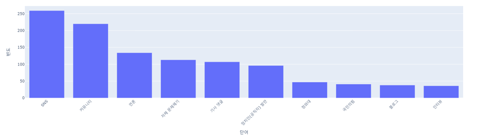
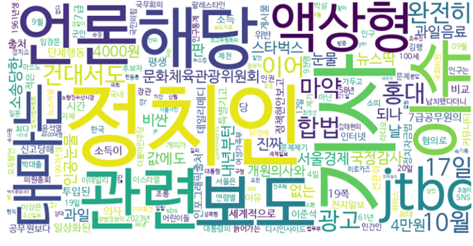
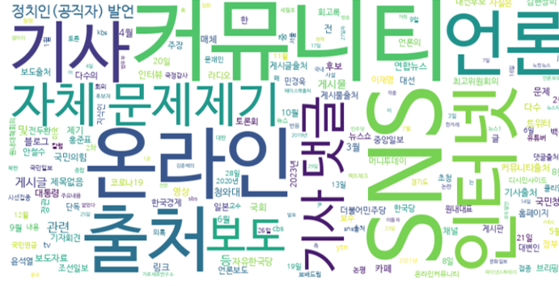

# False Information Dataset And Analysis

### Source : SNU factcheck

## Label data ratio

- Original Data : 사실, 대체로 사실, 판단 유보, 절반의 사실, 대체로 사실 아님, 전혀 사실 아님
- Transformed Data : 사실, 거짓

## Date frequency

## Word frequency analysis

#### Title

#### Source

## Word Crowd

#### Title

#### Source

## Machine Learning

### Classification - Logistic Regression

|       | Precision | Recall | F1 Score | Accuracy |
| ----- |:---------:| ------ | -------- | -------- |
| True  |   0.73    | 0.99   | 0.84     |          |
| False |   0.57    | 0.02   | 0.04     |          |
|       |           |        |          | 0.73     | 

### Sequencial analysis - ARIMA

| MSE  | RMSE | MAE  |
| ---- | ---- | ---- |
| 3.41 | 1.85 | 1.61 | 

